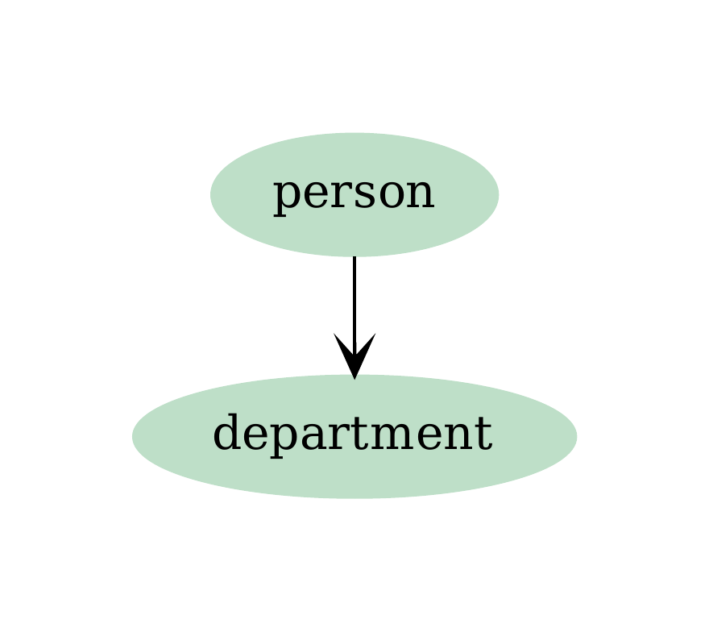
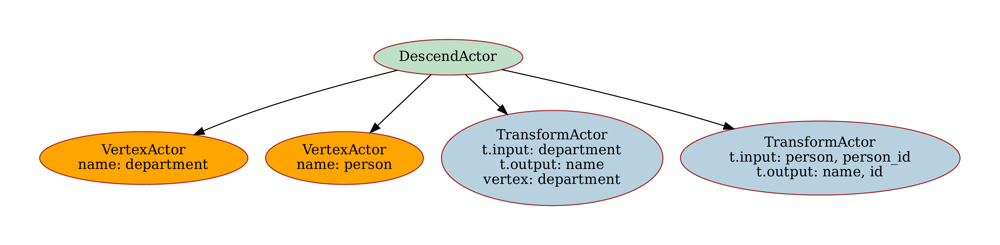
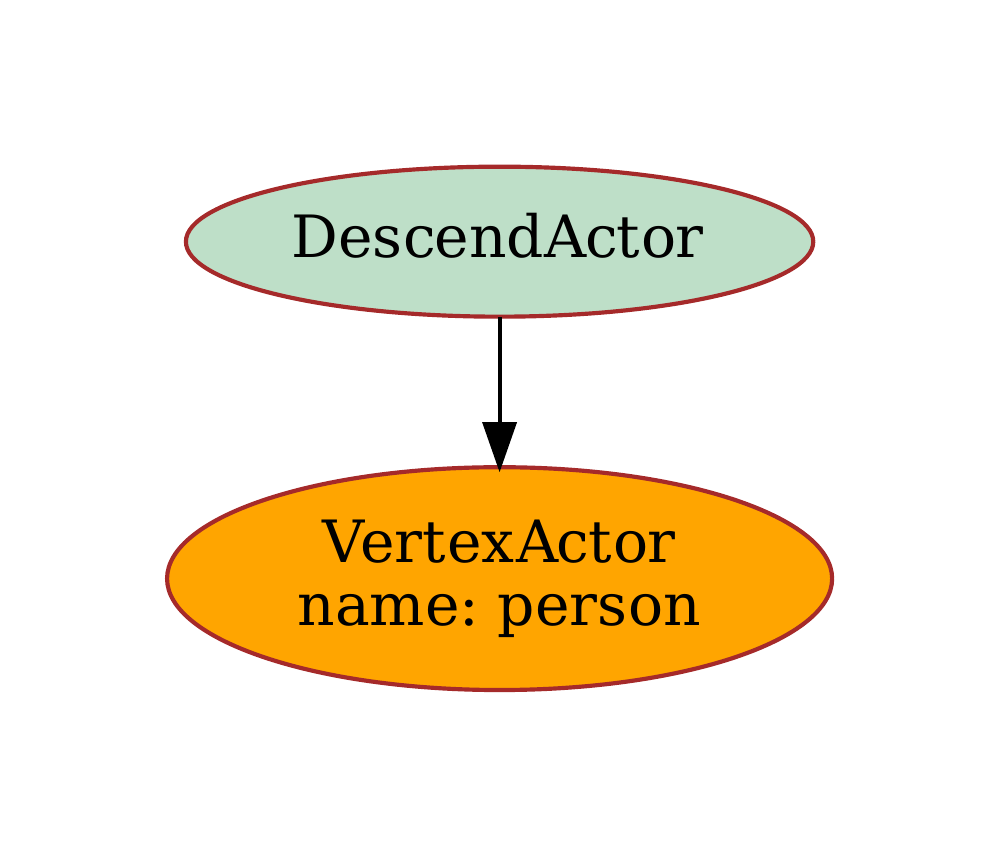

# Example 1: Multiple Tabular Sources


Suppose we have a table that represents people:

```csv
# people.csv
id,name,age
1,John Hancock,27
2,Mary Arpe,33
3,Sid Mei,45
```

and a table that represents their roles in a company:

```csv
# departments
person_id,person,department
1,John Dow,Sales
2,Mary Arpe,R&D
3,Sid Mei,Customer Service
```

We want to define vertices `Person` and `Department` and set up the rules of how to map tables to vertex key-value pairs.

Let's define vertices as

```yaml
 vertices:
 -   name: person
     fields:
     -   id
     -   name
     -   age
     indexes:
     -   fields:
         -   id
 -   name: department
     fields:
     -   name
     indexes:
     -   fields:
         -   name
```

and edges as 

```yaml
 edges:
 -   source: person
     target: department
```

The graph structure is quite simple:

{ width="200" }


Let's define the mappings: we want to rename the fields `person`, `person_id` and `department` and specify explicitly `target_vertex` to avoid the collision, since both `Person` and `Department` have a field called `name`.  

```yaml
-   resource_name: people
    apply:
    -   vertex: person
-   resource_name: departments
    apply:
    -   map:
            person: name
            person_id: id
    -   target_vertex: department
        map:
            department: name
```

Department Resource

{ width="700" }

People Resource

{ width="200" }


Transforming the data and ingesting it into an ArangoDB takes a few lines of code:

```python
from suthing import ConfigFactory, FileHandle
from graphcast import Caster, Patterns, Schema

schema = Schema.from_dict(FileHandle.load("schema.yaml"))

conn_conf = ConfigFactory.create_config(
    {
        "protocol": "http",
        "hostname": "localhost",
        "port": 8535,
        "username": "root",
        "password": "123",
        "database": "_system",
    }
)

patterns = Patterns.from_dict(
    {
        "patterns": {
            "people": {"regex": "^people.*\.csv$"},
            "departments": {"regex": "^dep.*\.csv$"},
        }
    }
)

caster = Caster(schema)
caster.ingest_files(
    path=".",
    conn_conf=conn_conf,
    patterns=patterns,
)

```

Please refer to [examples](https://github.com/growgraph/graphcast/tree/main/examples/1-ingest-csv)

For more examples and detailed explanations, refer to the [API Reference](../reference/index.md). 