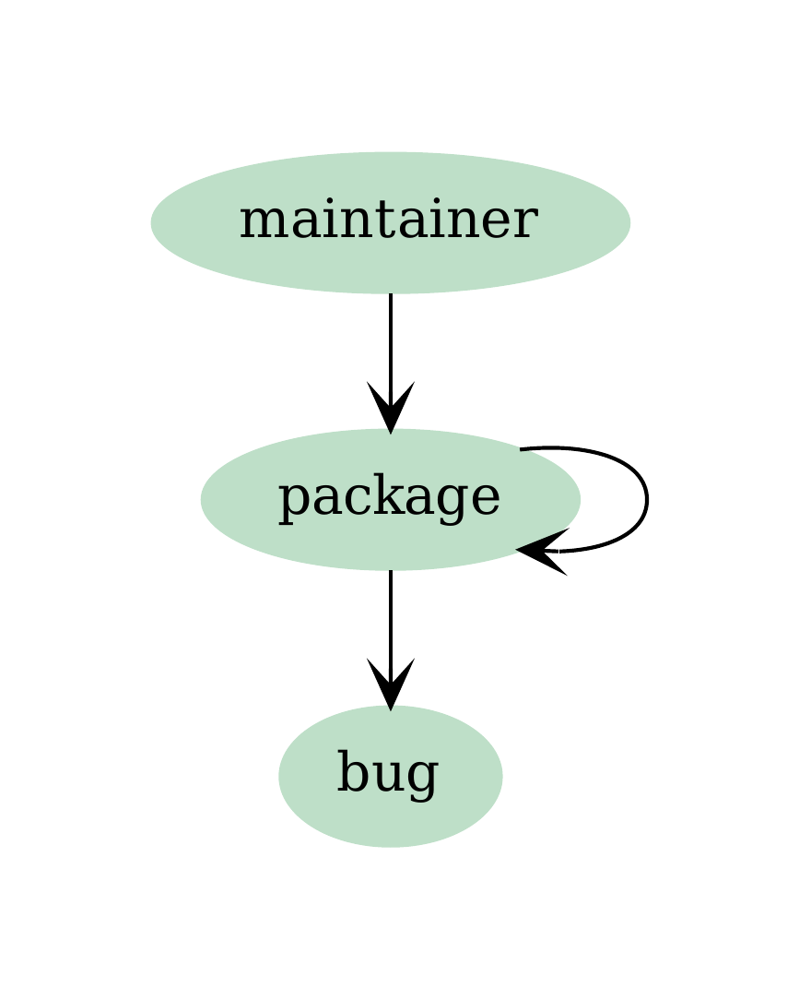

# Example 4: Dynamic Relations from Keys (Neo4j)

This example demonstrates how to ingest complex nested JSON data into Neo4j, using the `relation_from_key` attribute to dynamically create relationships based on the structure of the data.

## Data Structure

We're working with Debian package metadata that contains complex nested structures:

```json
{
  "name": "0ad-data",
  "version": "0.0.26-1",
  "dependencies": {
    "pre-depends": [
      {
        "name": "dpkg",
        "version": ">= 1.15.6~"
      }
    ],
    "suggests": [
      {
        "name": "0ad"
      }
    ]
  },
  "description": "Real-time strategy game of ancient warfare (data files)",
  "maintainer": {
    "name": "Debian Games Team",
    "email": "pkg-games-devel@lists.alioth.debian.org"
  }
}
```

## Schema Configuration

### Vertices
We define three vertex types:

```yaml
vertex_config:
    vertices:
    -   name: package
        fields:
        -   name
        -   version
        indexes:
        -   fields:
            -   name
    -   name: maintainer
        fields:
        -   name
        -   email
        indexes:
        -   fields:
            -   email
    -   name: bug
        fields:
        -   id
        -   subject
        -   severity
        -   date
        indexes:
        -   fields:
            -   id
```

### Edges
Edges are defined in a simple way:

```yaml
edge_config:
    edges:
    -   source: package
        target: package
    -   source: maintainer
        target: package
    -   source: package
        target: bug
```
### Graph Structure

The resulting graph shows the following package dependency relationships:

{ width="200" }


## Resource (Nested Structure)

### Nested Structure Handling
The resource configuration handles deeply nested data:

```yaml
resources:
-   resource_name: package
    apply:
    -   vertex: package
    -   key: dependencies
        apply:
        -   key: breaks
            apply:
            -   vertex: package
        -   key: conflicts
            apply:
            -   vertex: package
        -   key: depends
            apply:
            -   vertex: package
        -   key: pre-depends
            apply:
            -   vertex: package
        -   key: suggests
            apply:
            -   vertex: package
        -   key: recommends
            apply:
            -   vertex: package
    -   source: maintainer
        target: package
    -   source: package
        target: package
        relation_from_key: true
    -   key: maintainer
        apply:
        -   vertex: maintainer
```

We use `relation_from_key: true` to:

- Use the JSON keys as relationship types
- Create different edge types based on the nested structure
- Instead of a single edge type, we get multiple edge types: `breaks`, `conflicts`, `depends`, `pre-depends`, `suggests`, `recommends`


## How It Works

1. **Package Creation**: Each package becomes a vertex
2. **Dynamic Relations**: Each dependency type (`breaks`, `conflicts`, etc.) becomes a relationship type
3. **Maintainer Links**: Maintainer information creates `maintainer` → `package` relationships
4. **Bug Tracking**: Bug reports create `package` → `bug` relationships

## Resource Structure

The resource mapping handles complex nested package data:

{ width="700" }

{ width="700" }

## Data Ingestion

The ingestion process handles the complex nested structure:

```python
from suthing import ConfigFactory, FileHandle
from graphcast import Caster, Patterns, Schema

schema = Schema.from_dict(FileHandle.load("schema.yaml"))

conn_conf = ConfigFactory.create_config({
    "protocol": "bolt",
    "hostname": "localhost",
    "port": 7688,
    "username": "neo4j",
    "password": "test!passfortesting",
})

patterns = Patterns.from_dict({
    "patterns": {
        "package": {"regex": r"^package\.meta.*\.json(?:\.gz)?$"},
        "bugs": {"regex": r"^bugs.head.*\.json(?:\.gz)?$"},
    }
})

caster = Caster(schema)
caster.ingest_files(
    path="./data",
    conn_conf=conn_conf,
    patterns=patterns,
    clean_start=True,
)
```

## Use Cases

This schema is useful for:

- **Package Management**: Modeling software dependencies and conflicts
- **Ecosystem Analysis**: Understanding complex dependency graphs
- **Compliance Checking**: Identifying breaking changes and conflicts
- **Maintenance Planning**: Tracking maintainer responsibilities

## Key Takeaways

1. **`relation_from_key: true`** enables dynamic relationship creation from JSON structure
2. **Nested Processing** handles complex hierarchical data
3. **Flexible Relationships** support various dependency types
4. **Scalable Modeling** works with large package ecosystems

## Comparison with Example 3

- **Example 3**: Uses `relation_field` for CSV data with explicit relationship columns
- **Example 4**: Uses `relation_from_key` for JSON data with implicit relationship structure
- **Both**: Enable multiple relationship types between the same entity pairs
- **Difference**: Data source format and relationship specification method

Please refer to [examples](https://github.com/growgraph/graphcast/tree/main/examples/4-ingest-neo4j)

For more examples and detailed explanations, refer to the [API Reference](../reference/index.md).
